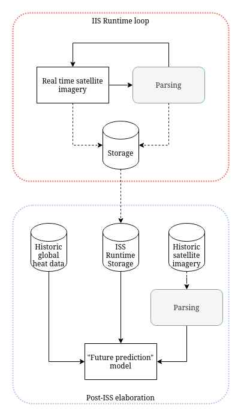

[**Astropi**](https://astro-pi.org/) Phase 1: Design

<!-- omit in toc -->
# /* NOME TEAM */  

- [1. Introduction](#1-introduction)
- [2. Technical](#2-technical)
  - [2.1. Real-time elaboration](#21-real-time-elaboration)
  - [2.2. Post-Izzy elaboration](#22-post-izzy-elaboration)
  - [2.3. Satellite imagery parsing](#23-satellite-imagery-parsing)
- [3.  Expected results](#3-expected-results)

## 1. Introduction
Global warming is the main actor of many environmental disasters, such as sea-level rise, frequent wildfires resulting in heavy deforestation, drought and desertification, glacier retreat, etc.

We'll analyze the pysical effects that such disasters had in the past over the environmet and compare them with the change in global temperature over the years.

The final objective is to create an algorithm able to predict the impact that various scenarios of global heating will have to the environment.
 
## 2. Technical
The technical procedure is made of two phases: 
- Real-time elaboration, on the "Izzy" pc
- Post-Izzy elaboration

> <small>Graphic representation of the tasks separation<small>

### 2.1. Real-time elaboration
### 2.2. Post-Izzy elaboration
### 2.3. Satellite imagery parsing
## 3.  Expected results